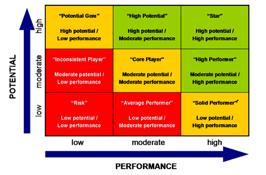

# NLP_Employee_Performance
Predicting employee performance rating based on the feedback text that was provided.  

### Table of Contents

1. [Installation](#installation)
2. [Project Motivation](#motivation)
3. [File Descriptions](#files)
4. [Data Files](#data)
5. [Target Values - Employee Performance Rating](#categories)
6. [Testing](#testing)
7. [Results](#results)
8. [Licensing, Authors, and Acknowledgements](#licensing)

---

## Installation 

The following libraries were installed as part of this project:
 - Sentiment_Scoring_Analysis.ipynb
   - NLTK Vader
   - TextBlob
   - Flair
 
- EDA_Prepare_Data.ipynb
  - NLTK tokenize 
  - Flair
  - textstat

- EDA_NLP_Feedback.ipynb
  -  matplotlib
  -  seaborn
  -  re (regex)
  -  contractions
  
  
  
- Employee_Feedback_Sentiment_Analysis.ipynb
  -  NLTK (word_tokenize, punkt, WordNetLemmatizer, pos_tag)
  -  sklearn preprocessing (OneHotEncoder,LabelEncoder , OrdinalEncoder, FunctionTransformer, ColumnTransformer)
  -  sklearn pipeline (Pipeline, FeatureUnion)
  -  sklearn TfidfVectorizer
  -  sklearn model ( GridSearchCV, train_test_split)
  -  xgboost (XGBClassifier)
  -  sklearn metrics (confusion_matrix, f1_score, accuracy_score)
  -  matplotlib, seaborn
  -  re (regex)
  -  contractions
  -  Flair
  -  clone 

---
## Project Motivation

For my final capstone project, I wanted to focus on NLP and the analysis employee performance ratings which is related to some of my current professional projects. 

Using actual employee performance feedback and ratings was not an option so I began my search for publicly available data and found a dataset on [Kaggle](https://www.kaggle.com/datasets/fiodarryzhykau/employee-review). That work focused on testing classic machine learning algorithms to determine which algorithm could best predict the employee's performance rating using the feedback comments provided by the employer.  Performance ratings/categories are listed [below](#categories).

My goal was to extend beyond that work and include a sentiment score and test an ordinal classifier to see if I could improve on the accuracy of the model. I used XGBoost throughout my testing since the focus was on the sentiment scoring and ordinal and not testing ML algorithm performance. Sentiment Scoring was generated using [Flair](https://www.analyticsvidhya.com/blog/2019/02/flair-nlp-library-python/). The OrdinalClassifer used was provided by Muhammad Assagaf was dowloaded from [Medium.com](https://medium.com/towards-data-science/simple-trick-to-train-an-ordinal-regression-with-any-classifier-6911183d2a3c)

---
## File Descriptions 

There are 4 Jupyter notebooks associated with this project and 2 data files downloaded from [Kaggle](https://www.kaggle.com/datasets/fiodarryzhykau/employee-review).  

Jupyter Notebooks:
- Sentiment_Scoring_Analysis.ipynb
  -  A comparison of Vader, TextBlob & Flair to determine which sentiment scoring method is best suited for the project. 
  -  Sample phrases were tested and manually inspected. Flair was chosen and used in the final model.
  
- EDA_Prepare_Data.ipynb
  - Prepare data for exploratory analysis. 
  - Sentiment scores are added to each sentence and data exported to ./data/feedback.csv
    
- EDA_NLP_Feedback.ipynb
  - Inspection of the data and visualizations to reveal necessary cleansing, determine accuracy measurements and identify missing data.

- Employee_Feedback_Sentiment_Analysis.ipynb
  - Final model to load and clean data, tokenize text and apply the ordinal classifier and sentiment score
  - F1 scores and heatmaps are generated 

---
## Data Files 
These two files were joined into a single dataset and split into train/test within the code. 
- employee_review_mturk_dataset_test_v6_kaggle.csv
- employee_review_mturk_dataset_v10_kaggle.csv

Each of the data files has 6 columns:
 - unique id
 - employee name
 - nine-box performance rating
 - feedback text
 - reviewed (was the performance rating reviewed)
 - adjusted (was the performance rating adjusted)
 
 
---
## Target Values - Employee Performance Ratings 

The target 'y' value was the performance rating. It was represented as both an ordered list and as a nine-box matrix. 

Categories were ordered as follows: 
- Category 1: 'Risk' (Low performance, Low potential)
- Category 2: 'Average performer' (Moderate performance, Low potential)
- Category 3: 'Solid Performer' (High performance, Low potential)
- Category 4: 'Inconsistent Player' (Low performance, Moderate potential)
- Category 5: 'Core Player' (Moderate performance, Moderate potential)
- Category 6: 'High Performer' (High performance, Moderate potential)
- Category 7: 'Potential Gem' (Low performance, High potential)
- Category 8: 'High Potential' (Moderate performance, High potential)
- Category 9: 'Star' (High performance, High potential)

And represented in this nine-box matrix:

---

## Testing

To test the variations, code must be modified slightly. There was an attempt to more dynamically test all scenarios but ultimately my local system did not have the memory needed. 

Exclusion of the sentiment scoring can be achieved by commenting the 'sentiment' step in the FeatureUnion

      text_union = FeatureUnion([
          ('sentiment', text_transformer),
          ('tfidf',TfidfVectorizer(tokenizer=tokenize ))
      ])

To include/exclude the OrdinalClassifier, commenting the appropriate line within the pipeline is necessary.

      #model predict using XGBClassifier
      #('clf', XGBClassifier(use_label_encoder=False, verbosity = 0))
      ('clf', OrdinalClassifier(XGBClassifier(use_label_encoder=False, verbosity = 0)))

---
## Results

Addition of the sentiment scoring increase the weighted f1 score by 8.7%. The sentiment scoring did aid in the predictions but with the max f1 score of 0.39, deep learning is likely still a better option. 

Inclusion of the Ordinal Classifier actually dropped the f1 score by 6.0%. This project seems to indicate that performance ratings are best represented as that nine-box matrix and not as an ordered list. 

A full discussion of the results can be found at the blog post available [here](https://medium.com/@marcellatietjen/nlp-and-employee-performance-ratings-9d37956c388e).

---
## Licensing, Authors, Acknowledgements

Employee feedback data was downloaded from [Kaggle](https://www.kaggle.com/datasets/fiodarryzhykau/employee-review).  

OrdinalClassifier() by Muhammad Assagaf was dowloaded from [Medium.com](https://medium.com/towards-data-science/simple-trick-to-train-an-ordinal-regression-with-any-classifier-6911183d2a3c)

Custom LabelEncoder from [StackOverflow](https://stackoverflow.com/questions/51308994/python-sklearn-determine-the-encoding-order-of-labelencoder)

Other acknowledgements of code leveraged via Stackoverflow are documented within the code itself. 

